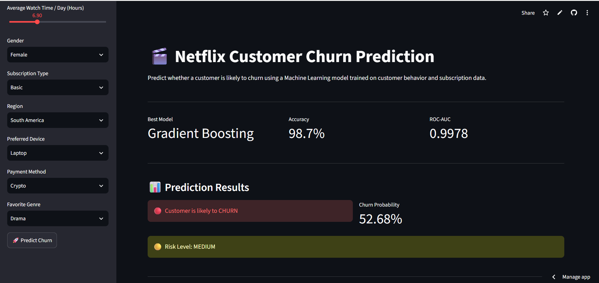
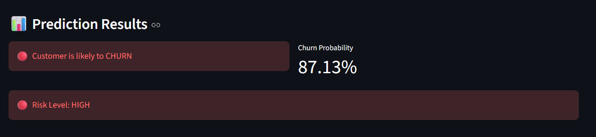
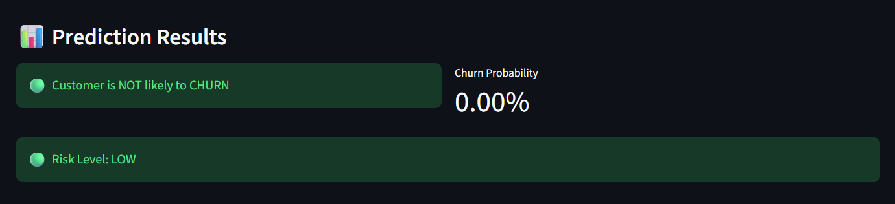

# 🎬 Netflix Customer Churn Prediction

<p align="center">
  
  
  
  
</p>

An **end-to-end Machine Learning project** that predicts whether a Netflix customer is likely to **churn** based on customer behavior, subscription details, and engagement patterns. The project demonstrates the complete ML lifecycle, from **EDA and feature engineering** to **model deployment using Streamlit**.

---

## 📌 Project Overview

Customer churn is one of the most critical business problems for subscription-based services. This project helps identify customers who are at risk of leaving the platform, enabling businesses to take proactive retention measures.

The model analyzes customer engagement metrics such as **watch hours, last login days, subscription type, payment method, and average watch time per day** to predict churn probability and provide actionable business recommendations.

---

## 🚀 Live Demo

🔗 **Streamlit App:** [https://customerchurnprediction-netflix.streamlit.app/]

---

## ✨ Key Features

- 📊 Performed comprehensive **Exploratory Data Analysis (EDA)** to identify churn-driving factors.
- 🛠️ Applied **feature engineering** and **categorical encoding** for better model performance.
- 🤖 Compared multiple ML models:
  - Logistic Regression
  - Decision Tree
  - Random Forest
  - Gradient Boosting
  - SVM
  - KNN
  - Naive Bayes
- 🏆 Selected **Gradient Boosting** as the final model after hyperparameter tuning.
- 🔍 Implemented **SHAP Explainable AI** to interpret model predictions.
- 🌐 Built and deployed an interactive **Streamlit web application** for real-time churn prediction.
- 💡 Added **risk-level assessment** and **business recommendations** for customer retention.

---

## 📂 Dataset Information

The dataset contains customer subscription and engagement data with features such as:

| Feature | Description |
|---------|-------------|
| `age` | Customer age |
| `watch_hours` | Total watch hours |
| `last_login_days` | Days since last login |
| `monthly_fee` | Monthly subscription fee |
| `number_of_profiles` | Number of profiles on the account |
| `avg_watch_time_per_day` | Average daily watch time |
| `subscription_type` | Basic, Standard, or Premium plan |
| `payment_method` | Customer payment method |
| `churned` | Target variable (0 = Stayed, 1 = Churned) |

---

## 🧠 Machine Learning Workflow

```text
Data Collection
      ↓
Exploratory Data Analysis (EDA)
      ↓
Data Preprocessing
      ↓
Feature Engineering
      ↓
Model Training & Comparison
      ↓
Hyperparameter Tuning
      ↓
Model Evaluation
      ↓
SHAP Explainability
      ↓
Streamlit Deployment
```

---

## 🏆 Model Performance

| Metric | Score |
|--------|--------|
| **Best Model** | Gradient Boosting Classifier |
| **Accuracy** | **98.7%** |
| **ROC-AUC Score** | **0.9978** |
| **Task Type** | Binary Classification |

---

## 🛠️ Tech Stack

### Programming & Data Analysis
- **Python**
- **Pandas**
- **NumPy**

### Visualization
- **Matplotlib**
- **Seaborn**

### Machine Learning
- **Scikit-learn**
- **Gradient Boosting**
- **SHAP**

### Deployment
- **Streamlit**
- **Joblib**
- **GitHub**

---

## 📁 Project Structure

```text
Customer_Churn_Prediction/
│
├── app.py                          # Streamlit web application
├── requirements.txt                # Project dependencies
├── README.md                       # Project documentation
│
├── models/
│   ├── customer_churn_model.pkl    # Trained Gradient Boosting model
│   ├── feature_names.pkl           # Feature names for prediction
│   └── scaler.pkl                  # Scaler used during preprocessing
│
├── notebooks/
│   └── CustomerChurnPrediction2.ipynb  # EDA and model development
│
└── data/
    └── netflix_customer_churn.csv  # Dataset
```

---

## 📊 Streamlit App Features

The deployed web application allows users to:

- Enter customer details through a user-friendly interface.
- Predict whether a customer is likely to churn.
- View **churn probability** and **risk level** (Low, Medium, High).
- Analyze customer summary information.
- Receive **business recommendations** for customer retention.

---

## 🔍 Explainable AI with SHAP

To improve model transparency, **SHAP (SHapley Additive exPlanations)** was used to explain how each feature contributes to the churn prediction. This helps stakeholders understand **why** the model predicts a customer is likely to churn.

---

## 💡 Business Impact

This project can help subscription-based businesses:

- Identify high-risk customers before they leave.
- Design targeted retention campaigns.
- Optimize subscription plans and pricing strategies.
- Improve customer engagement through personalized recommendations.
- Reduce revenue loss caused by customer churn.

---

## 📸 Project Screenshots

### 🏠 Main Dashboard

<p align="center">
  
</p>

---

### 🔴 High Churn Prediction

<p align="center">
  
</p>

---

### 🟢 Low Churn Prediction

<p align="center">
  
</p>
---

## ⚡ Installation & Usage

### Clone the Repository

```bash
git clone https://github.com/Siddharthcdt25/Customer_Churn_Prediction.git
cd Customer_Churn_Prediction
```

### Install Dependencies

```bash
pip install -r requirements.txt
```

### Run the Streamlit App

```bash
streamlit run app.py
```

---

## 🔮 Future Improvements

- Add **Plotly gauge charts** for better probability visualization.
- Integrate **SHAP explanations directly into the Streamlit app**.
- Enhance UI/UX with custom CSS styling.
- Add user authentication for production-level deployment.
- Connect the app to a real-time customer database.

---

## 👨‍💻 Author

**Siddharth Kashyap**

- 🎓 B.Tech CSE Student | AI/ML Enthusiast
- 💼 Aspiring Machine Learning Engineer
- 🔗 GitHub: [Siddharthcdt25](https://github.com/Siddharthcdt25)

---

## ⭐ Support

If you found this project useful, consider giving it a **⭐ star** on GitHub. It helps increase the visibility of the project and motivates further improvements.

---

<p align="center">
  <b>Built with ❤️ using Python, Scikit-learn, SHAP, and Streamlit</b>
</p>
